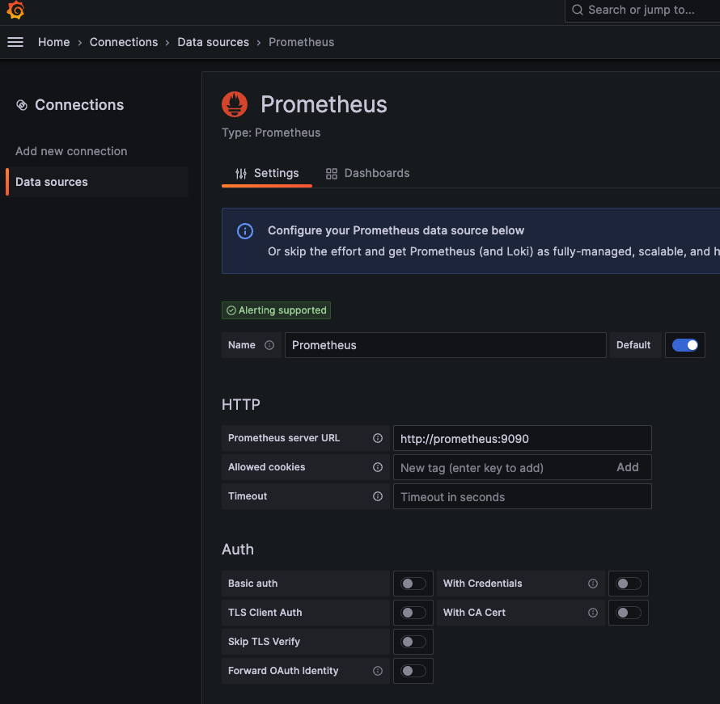
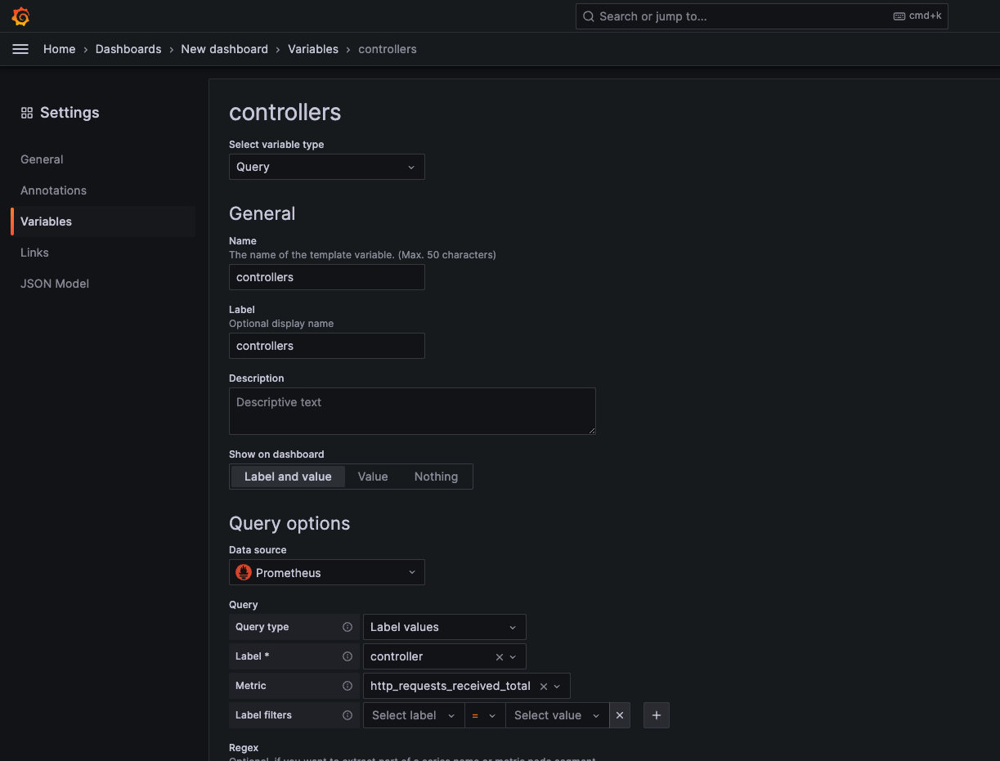
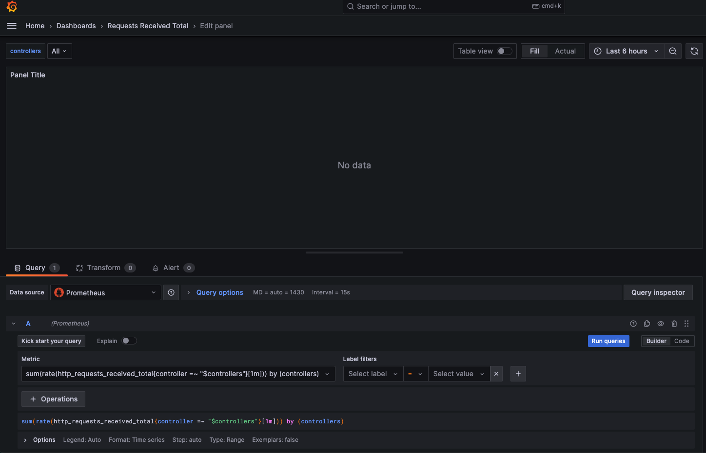
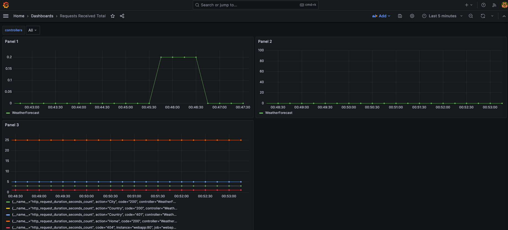

# .NET Prometheus & Grafana

Set up .NET Prometheus & Grafana using docker-compose (podman-compose).

## Packages

Install `prometheus-net.AspNetCore` package.

## Code

Create a basic ASP.NET Web API like:

```bash
dotnet new webapi -o dotnet-prometheus-grafana
```

Add required code in `Program.cs`.

```csharp
app.UseRouting();
app.UseHttpMetrics();
...
app.MapMetrics();
...
```

## Run

`docker-compose up` or `podman-compose up`


## Grafana Dashboard Configuration









